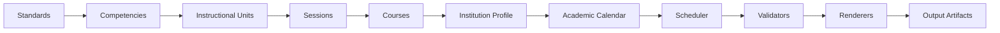

# 0001: System Overview

- Status: Proposed
- Scope: Define TEOS system boundaries, major subsystems, data flow, and
  ownership.

## System Purpose

TEOS is an architecture for compiling standards-aligned technical curriculum
into validated, institution-specific schedules, documents, and integration
packages. It preserves curriculum as the authoritative description of
educational intent while applying institutional presentation and scheduling
constraints as separate inputs.

The system boundary begins with maintained source data and ends with generated
artifacts. Enrollment, grading, staffing, room booking, and operation of
external learning or student systems remain outside TEOS.

## Major Subsystems

### Curriculum Engine

The Curriculum Engine loads and composes canonical curriculum objects. It
resolves their identities and versions, preserves their declared ordering, and
provides a coherent curriculum graph to downstream validation, scheduling,
rendering, and export stages. It must not apply institutional dates, branding,
or layout.

### Standards and Competency Model

This subsystem defines the traceable relationship between requirements and
observable learner capabilities. It preserves Standard provenance and version
references, Competency identity, prerequisite relationships, and evidence or
assessment intent. It does not schedule instruction.

### Instructional Unit Model

This subsystem groups related Competencies into coherent teachable units. It
owns unit-level outcomes, prerequisites, resource and safety context, and the
declared Session sequence. It remains independent of institutional meeting
patterns and dates.

### Session Model

The Session Model defines the smallest schedulable instructional events. It
owns Session identity, purpose, type, estimated duration, theory and lab
allocation, Competency coverage, prerequisites, resources, safety
requirements, and sequencing dependencies. It contains no assigned calendar
date or Week or Day identity.

### Course Model

The Course Model organizes ordered Instructional Units into a complete
offering. It owns course identity, description, governing Standards,
curriculum-level completion requirements, and expected instructional scope.
It neither selects an institution nor embeds a schedule.

### Institution Profile Engine

The Institution Profile Engine resolves institution and campus identity,
branding, calendar references, meeting patterns, instructional-day lengths,
theory and lab conventions, terminology, templates, local policy references,
and export settings. It supplies local configuration without changing
curriculum content.

### Academic Calendar Engine

The Academic Calendar Engine resolves instructional periods, available meeting
dates, holidays, closures, and other institution-owned date constraints. It
contains and returns no curriculum content.

### Scheduler

The Scheduler maps ordered Sessions to eligible calendar occurrences using the
Course, Institution Profile, and Academic Calendar. It produces an explicit
schedule, conflict findings, and a list of unscheduled Sessions. Scheduling
policy and contracts are defined in
[0003: Session Scheduler](0003-session-scheduler.md); implementation algorithms
are intentionally deferred.

### Validation Engine

The Validation Engine evaluates source objects, cross-object relationships,
architectural boundaries, institution and calendar configuration, scheduling
results, and output contracts. It reports errors, warnings, and contextual
diagnostics without silently rewriting authoritative inputs.

### Rendering Engine

The Rendering Engine combines validated curriculum, schedule results,
Institution Profile presentation settings, and templates to produce human- or
machine-consumable artifacts. Renderers do not own or modify the source data
they present.

### Template System

The Template System provides versioned presentation structures for supported
artifact types. Templates control layout and presentation, may expose
institution-approved headers and footers, and must not become stores of
canonical curriculum or calendar facts.

### Export and Integration Layer

This layer maps validated TEOS information into destination-specific documents,
packages, feeds, or interfaces, including LMS-oriented outputs. It owns
destination mappings and compatibility behavior, while preserving source
identity, version, and provenance. External-system state is outside the
canonical TEOS data model.

## High-Level Data Flow

The diagram expresses the principal compilation flow, not data ownership.
Institution Profiles and Academic Calendars remain independent inputs rather
than becoming children of a Course. Validation also occurs at earlier
boundaries, even though the diagram shows the final validation gate before
rendering.

## Compilation and Production Pipeline

### 1. Curriculum Compilation

The Curriculum Engine resolves the selected Course version and follows its
references through Instructional Units, Sessions, Competencies, and Standards.
It produces a coherent, ordered curriculum graph with source identities and
versions intact. Compilation does not assign dates or alter educational
meaning.

Curriculum source and relationship validation occurs during this stage.
Unresolved references, contradictory dependencies, incomplete identities, or
invalid ownership boundaries stop the affected downstream operation.

### 2. Institution-Profile Application

A selected Institution Profile is resolved independently and checked for
compatibility with the requested output and scheduling operation. The profile
contributes meeting patterns, instructional-day lengths, presentation
standards, terminology, calendar references, local policy references,
templates, and integration settings.

Application means supplying institutional context to later stages. It does not
merge institutional facts into canonical curriculum or create an
institution-specific fork of a Competency.

### 3. Calendar Resolution

The Academic Calendar Engine resolves the profile's calendar reference and
identifies eligible instructional dates, periods, holidays, and closures. The
calendar is validated independently of curriculum and then made available to
the Scheduler as date constraints.

### 4. Scheduling

The Scheduler evaluates the ordered Sessions against the Institution Profile's
meeting conventions and the Academic Calendar's availability. It maps each
placeable Session to one or more calendar occurrences when permitted by the
Session contract, preserves dependency and sequencing requirements, and
reports conflicts or Sessions it cannot place.

Week and Day labels may be derived from the resulting schedule for display or
navigation. They do not replace Session identities.

### 5. Validation

Validation is staged rather than deferred to the end:

- source validation checks each curriculum, profile, calendar, and template
  input;
- relationship validation checks references, versions, ordering, and
  dependencies;
- boundary validation checks separation among curriculum, institution,
  calendar, template, and generated data;
- schedule validation checks placements, allocations, constraints, conflicts,
  and unscheduled Sessions; and
- artifact and export validation checks target completeness, provenance, and
  contract conformance.

Only inputs and intermediate results valid for a requested operation proceed.
A rendering-only operation that does not require a schedule need not invent
one, but it must still satisfy its applicable validation gates.

### 6. Rendering

The Rendering Engine selects a compatible template and combines the validated
curriculum graph, optional validated schedule, and Institution Profile
presentation configuration. Rendering is deterministic with respect to its
declared inputs and must preserve provenance.

### 7. Export and Integration

When the target is an external system or package format, the Export and
Integration Layer applies destination mappings and target validation. It
produces a generated package or transfer representation; it does not promote
destination-specific values into canonical curriculum.

## Output Artifacts

Output artifacts may include course plans, Session plans, schedules, instructor
or learner documents, compliance reports, LMS packages, machine-readable
exports, and provenance manifests. The set of supported artifact types may
evolve, but all are rendered products of declared source versions and
configuration.

Artifacts belong under `output/`, are replaceable, and must not be committed.
They may be regenerated when sources, configuration, templates, engine
versions, or requested formats change.

## Source Data and Generated Output

Canonical source data lives in the appropriate top-level source directory:
curriculum in `curriculum/`, institution configuration in `institutions/`,
calendars in `calendars/`, and templates in `templates/`. Conceptual
definitions and architecture records describe meaning and boundaries but are
not generated products.

Generated output must never be edited as the authoritative way to change
curriculum, scheduling policy, branding, calendar availability, or template
behavior. Changes are made in the owning source and artifacts are regenerated.
This one-way relationship protects traceability and prevents rendered
documents from competing with source data.

## Related Architecture

- [0000: Guiding Principles](0000-guiding-principles.md) defines ownership,
  compatibility, validation, and artifact principles.
- [0002: Curriculum Model](0002-curriculum-model.md) defines the curriculum
  hierarchy.
- [0003: Session Scheduler](0003-session-scheduler.md) defines the conceptual
  scheduling contract.
- [0004: Institution Profiles](0004-institution-profiles.md) defines
  institution-owned configuration.
