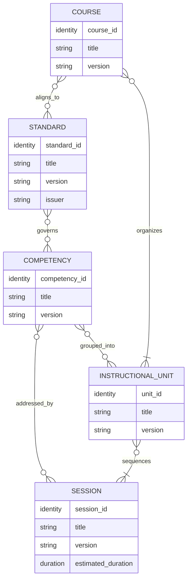

# 0002: Curriculum Model

- Status: Proposed
- Scope: Define the conceptual hierarchy and relationships among Standards,
  Competencies, Instructional Units, Sessions, and Courses.

## Model Boundary

The TEOS curriculum model describes educational intent independently of
delivery institution, academic calendar, scheduling result, and presentation
format. It is the canonical source for what a curriculum requires and how its
instructional parts relate.

The hierarchy is traceable rather than strictly nested. A Standard can inform
many Competencies; a Competency can be taught in more than one Instructional
Unit or Course; and curriculum objects are connected by stable references
rather than by copying their authoritative content.

## Conceptual Relationships

The fields shown are conceptual identity requirements, not a serialization
schema. Cardinalities describe supported relationships: references may be
shared, while every Instructional Unit and Course must organize instructional
content.

## Standard

### Purpose

A Standard describes an external or internal body of technical-education
requirements against which curriculum can be traced.

### Responsibilities

- preserve the official identity and title of the requirements;
- identify the issuing or governing organization;
- identify the applicable edition, revision, or version;
- preserve source and provenance information;
- identify or reference the Competencies used to satisfy its requirements; and
- support traceability without rewriting the official requirement.

### Required Identity Fields

A Standard requires a stable TEOS identity, its official identifier when one
exists, a human-readable title, an issuer or owner, and a version or revision.
The TEOS identity must distinguish Standards that happen to reuse the same
official identifier in different issuing contexts.

### Relationships

A Standard governs or informs zero or more Competencies. A Competency may map
to multiple Standards, and a Course may declare alignment to governing
Standards. Mappings must preserve the identity and version of the Standard
being referenced.

### Dependencies

A Standard depends on an identifiable authoritative source or an explicitly
identified internal owner. It does not depend on a Course, institution,
calendar, or rendering format to have meaning.

### Versioning Expectations

A new official edition or a change to requirement meaning requires a distinct
version. Corrections that do not change meaning must still retain revision
provenance. Competency mappings must identify the Standard version to which
they apply; they must not silently migrate to a later edition.

### Must Not Contain

A Standard must not contain teaching schedules, Session dates, institutional
branding, campus policy, template selection, or document-layout rules. It must
not be altered merely to fit a local calendar.

## Competency

### Purpose

A Competency describes an observable learner capability that can be taught,
practiced, demonstrated, or assessed.

### Responsibilities

- state the capability in observable, measurable language;
- preserve traceability to applicable Standards;
- declare prerequisite Competencies when required;
- describe evidence or assessment intent at the curriculum level;
- support instructional and assessment classification; and
- remain reusable across Instructional Units and Courses.

### Required Identity Fields

A Competency requires a stable identity, a human-readable title or concise
label, a capability statement, and a version. Its identity must remain stable
across presentation and scheduling contexts.

### Relationships

A Competency may map to zero or more Standards, may depend on other
Competencies, may be grouped into one or more Instructional Units, and may be
addressed by one or more Sessions. Courses gain Competency coverage through
their Instructional Units and may expose an aggregate traceability view.

### Dependencies

A Competency depends on its declared prerequisites and, when standards-aligned,
on resolvable Standard references. It does not depend on a specific Session,
Course, institution, or date for its identity.

### Versioning Expectations

A change to the learner capability, performance expectation, prerequisite
meaning, or required evidence creates a new version. Editorial clarification
may retain compatibility only when it does not change what the learner must be
able to do. References must state which version they use.

### Must Not Contain

A Competency must not contain institutional dates, local meeting patterns,
campus branding, instructor assignments, room assignments, template rules, or
document layout. It must not encode a Week or Day placement.

## Instructional Unit

### Purpose

An Instructional Unit groups related Competencies into a coherent, teachable
unit and defines the instructional sequence used to address them.

### Responsibilities

- state unit-level purpose and learning outcomes;
- identify the Competencies included or addressed;
- define curriculum-level prerequisite knowledge or Competencies;
- identify unit-level tools, equipment, resources, and safety context;
- organize one or more Sessions into an intentional sequence; and
- support reuse by Courses without acquiring institutional context.

### Required Identity Fields

An Instructional Unit requires a stable identity, a human-readable title, a
version, and a statement of instructional purpose or outcomes.

### Relationships

An Instructional Unit references one or more Competencies and contains an
ordered set of one or more Sessions. It may depend on earlier Instructional
Units or prerequisite Competencies. One or more Courses may reference the same
Instructional Unit version.

### Dependencies

The unit depends on resolvable Competency and Session references and on a
coherent internal sequence. Its resource or safety requirements may be
consolidated from its Sessions but cannot weaken Session-specific
requirements.

### Versioning Expectations

Changes to outcomes, included Competencies, required Sessions, sequence
semantics, prerequisites, or safety meaning require a new version. Reordering
is breaking when order conveys a prerequisite or instructional dependency.
Courses must reference an intentional unit version.

### Must Not Contain

An Instructional Unit must not contain academic dates, holiday handling,
institutional meeting patterns, campus identity, branding, template choice, or
document-layout rules. Week and Day headings may be rendered later but are not
unit structure.

## Session

### Purpose

A Session is the smallest schedulable instructional event in TEOS. It
describes a coherent unit of instruction with enough information for a
Scheduler to determine whether and where it can be placed.

### Responsibilities

- state its instructional purpose and delivery type;
- identify the Competencies and outcomes it addresses;
- define estimated duration and theory or lab allocation;
- declare prerequisite Sessions or Competencies;
- identify required tools, equipment, facilities, resources, and safety
  controls;
- express sequencing and splitting constraints; and
- provide curriculum source data for schedules and rendered artifacts.

### Required Identity Fields

A Session requires a stable identity, a human-readable title, a version, an
instructional purpose or outcome, a Session type, and an estimated duration.
Its identity must not be derived from a calendar date, Week number, Day number,
or rendered heading.

### Relationships

A Session is sequenced by at least one Instructional Unit and may address one
or more Competencies. It may depend on other Sessions or prerequisite
Competencies. A Session may appear within Courses through its Instructional
Unit; reuse must preserve identity and version.

### Dependencies

Session dependencies include declared prerequisites, ordered predecessors,
required resource capabilities, and safety conditions. These curriculum
requirements become Scheduler constraints when paired with an Institution
Profile and Academic Calendar.

### Versioning Expectations

A change to instructional purpose, Competency coverage, duration meaning,
delivery type, theory or lab allocation, prerequisites, required resources,
safety controls, or sequencing semantics requires a new version. A scheduled
occurrence references the Session version from which it was produced.

### Must Not Contain

A Session must not contain assigned dates, institution-specific meeting
numbers, holiday decisions, campus branding, local template choices, or
document-layout rules. It must not use Week or Day as its canonical identity.

Detailed scheduling semantics are defined in
[0003: Session Scheduler](0003-session-scheduler.md).

## Course

### Purpose

A Course organizes Instructional Units into a complete curriculum offering.

### Responsibilities

- define course identity, title, purpose, and description;
- identify governing Standards and curriculum scope;
- organize Instructional Units in an intentional order;
- state curriculum-level prerequisites and completion requirements;
- describe expected instructional hours without assigning dates; and
- expose traceability across its Units, Sessions, Competencies, and Standards.

### Required Identity Fields

A Course requires a stable identity, a human-readable title, a version, and a
description of purpose or scope. When an external catalog identifier is
retained, it supplements rather than replaces the stable TEOS identity unless
its governing authority and uniqueness are explicit.

### Relationships

A Course references an ordered set of one or more Instructional Units and may
reference governing Standards directly for alignment. Competency and Session
coverage are resolved through its Units. A Course is selected for application
by an Institution Profile and Scheduler, but it does not own either.

### Dependencies

A Course depends on resolvable, compatible Instructional Unit versions and on a
coherent course-level sequence. Its stated hours and completion requirements
must be consistent with its selected Units and Sessions.

### Versioning Expectations

Changes to course purpose, required Standards, ordered Units, completion
requirements, prerequisites, or expected instructional scope require a new
version. Updating a referenced Unit to a version with changed educational
meaning also requires an intentional Course revision.

### Must Not Contain

A Course must not contain institutional dates, holidays, campus details,
branding, local meeting patterns, instructor or room assignments, template
selection, or document-layout rules. It must not define Weeks or Days as
curriculum components.

## Cross-Object Integrity Rules

- Every reference must resolve to an explicit object identity and compatible
  version.
- Dependency relationships must be acyclic where a cycle would make completion
  or scheduling impossible.
- Declared ordering must not contradict prerequisite relationships.
- Course and Unit aggregates must remain consistent with the Sessions and
  Competencies they reference.
- Shared objects retain one authoritative definition; consumers do not create
  divergent copies.
- Curriculum objects must not contain institutional dates, branding, or
  document-layout rules.
- Institution-specific presentation and scheduling are applied only after the
  curriculum graph has been resolved and validated.

These integrity rules describe conceptual requirements. Machine-readable
contracts and implementation behavior are outside this document's scope.
